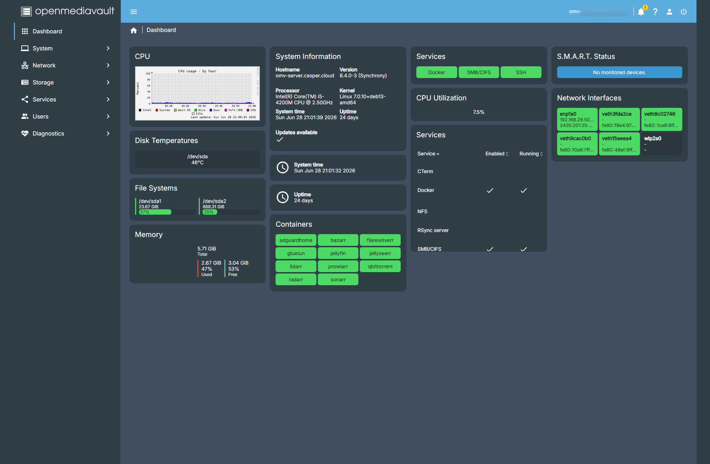
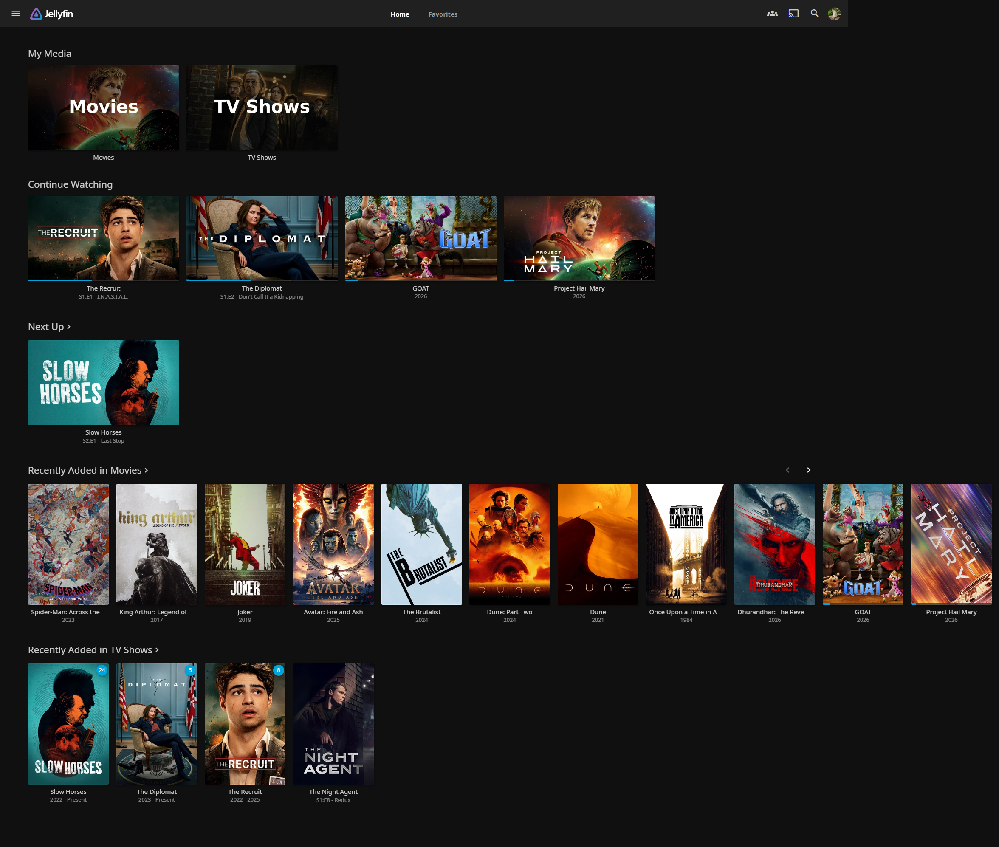
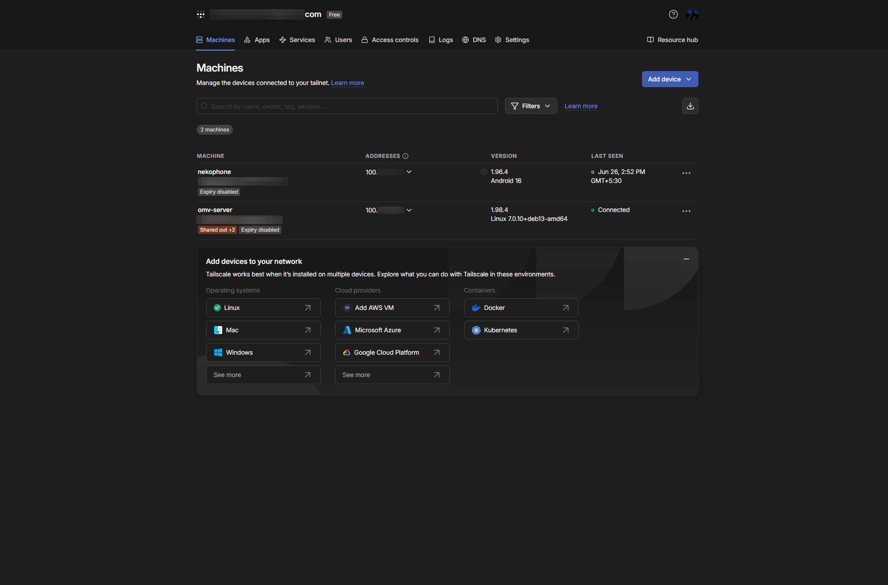
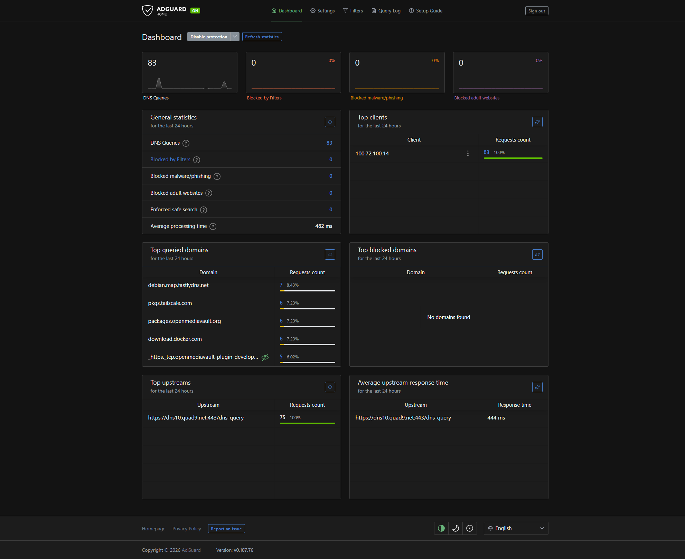

# Screenshots

## OpenMediaVault Dashboard

The server is managed through OpenMediaVault, providing visibility into system resources, Docker containers, storage and running services.

---

## Jellyfin

Jellyfin provides local and remote media streaming for authorised users.

---

## Jellyseerr

Users can request new movies and TV shows through Jellyseerr. Requests are automatically processed by Sonarr/Radarr and downloaded through the automated media pipeline.

---

## Tailscale

Remote access is secured using Tailscale, allowing authorised devices to access the HomeLab without exposing ports to the public Internet.

---

## AdGuard Home

AdGuard Home provides DNS filtering and network-wide advertisement blocking.

